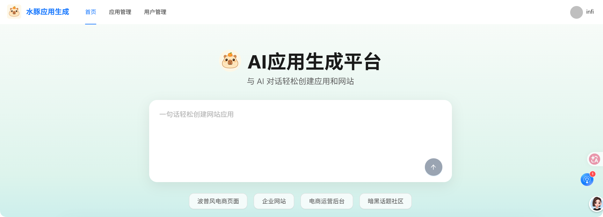
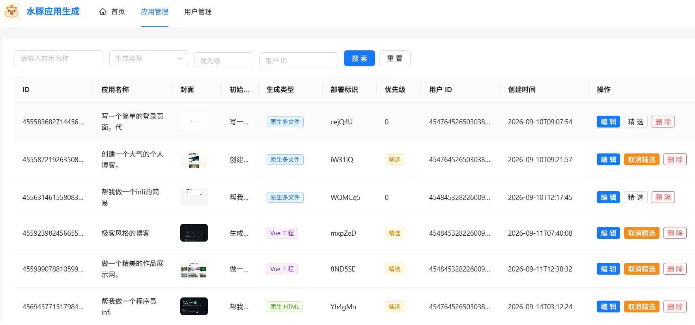
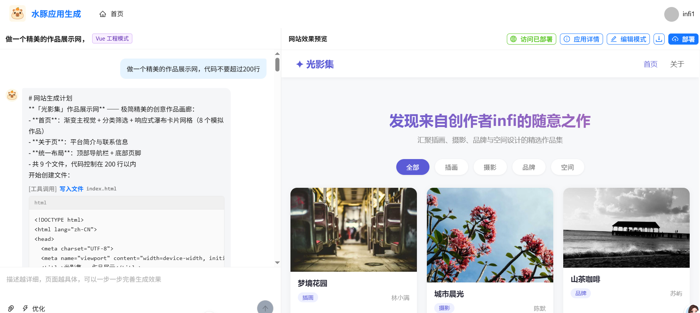

# AI Code Mother - AI 零代码应用生成平台

> 通过自然语言对话，一键生成可部署的 Web 应用。无需编写任何代码，描述你的想法，AI 帮你实现。

## 功能特性

- **对话式生成**：输入自然语言描述，AI 自动生成完整的网页应用
- **实时预览**：生成代码后即时在浏览器中预览效果
- **多轮对话**：支持持续对话迭代优化生成的页面
- **一键部署**：生成满意的应用后可一键部署，获得独立访问链接
- **双模式生成**：支持单文件 HTML 模式和多文件（HTML/CSS/JS）模式
- **精选案例**：首页展示优质应用案例，激发创作灵感
- **用户管理**：支持注册登录，管理员可管理用户和应用

## 技术栈

### 后端

| 技术 | 版本 | 说明 |
|------|------|------|
| Java | 21 | 编程语言 |
| Spring Boot | 3.4.1 | 应用框架 |
| MyBatis-Flex | 1.11.0 | ORM 框架 |
| LangChain4j | 1.1.0 | AI 模型集成 |
| MySQL | 8.x | 数据库 |
| Knife4j | 4.4.0 | API 文档 |

### 前端

| 技术 | 版本 | 说明 |
|------|------|------|
| Vue | 3.5 | 前端框架 |
| TypeScript | 6.0 | 编程语言 |
| Vite | 8.x | 构建工具 |
| Ant Design Vue | 4.x | UI 组件库 |
| Pinia | 4.x | 状态管理 |
| Vue Router | 5.x | 路由管理 |

## 快速开始

### 环境要求

- JDK 21+
- Node.js >= 22.18.0
- MySQL 8.x
- Maven（或使用项目自带的 `mvnw`）

### 1. 克隆项目

```bash
git clone https://github.com/your-repo/infi-ai-code-mother.git
cd infi-ai-code-mother
```

### 2. 初始化数据库

```bash
mysql -u root -p < sql/create_table.sql
```

这将创建 `infi_ai_code_mother` 数据库及 `user`、`app` 两张表。

### 3. 配置后端

编辑 `src/main/resources/application-local.yml`，配置 AI 模型参数：

```yaml
langchain4j:
  open-ai:
    chat-model:
      base-url: your-api-base-url
      api-key: your-api-key
      model-name: your-model-name
    streaming-chat-model:
      base-url: your-api-base-url
      api-key: your-api-key
      model-name: your-model-name
```

确保 `application.yml` 中的数据库连接信息正确（默认连接 `localhost:3306/infi_ai_code_mother`）。

### 4. 启动后端

```bash
./mvnw spring-boot:run
```

后端服务运行在 `http://localhost:8123/api`，API 文档访问地址：`http://localhost:8123/api/swagger-ui.html`

### 5. 启动前端

```bash
cd infi-ai-code-mother-frontend
npm install
npm run dev
```

前端开发服务器默认运行在 `http://localhost:5173`。

## 项目结构

```
infi-ai-code-mother/
├── src/main/java/org/infi/infiaicodemother/
│   ├── ai/                  # AI 服务集成层（LangChain4j）
│   ├── annotation/          # 自定义注解（@AuthCheck 权限校验）
│   ├── aop/                 # AOP 拦截器
│   ├── common/              # 通用工具类
│   ├── config/              # Spring 配置（CORS、JSON 等）
│   ├── constant/            # 常量定义
│   ├── controller/          # REST 控制器
│   ├── core/                # 核心业务逻辑
│   │   ├── parser/          # AI 输出代码解析器
│   │   └── saver/           # 代码文件保存器（模板方法模式）
│   ├── exception/           # 异常处理
│   ├── mapper/              # MyBatis-Flex Mapper
│   ├── model/               # 数据模型（DTO / Entity / VO / Enum）
│   └── service/             # 业务服务层
├── src/main/resources/
│   ├── application.yml      # 主配置文件
│   ├── application-local.yml# 本地开发配置（AI 模型参数）
│   └── prompt/              # AI 系统提示词模板
├── infi-ai-code-mother-frontend/   # Vue 3 前端项目
├── sql/                     # 数据库初始化脚本
└── doc/                     # 文档
```

## 核心流程

```
用户输入描述 → 创建应用 → 进入对话页面 → AI 生成代码 → 实时预览 → 迭代优化 → 一键部署
```

1. 用户在首页输入自然语言描述（如"做一个现代风格的电商首页"），创建应用
2. 进入对话页面，AI 根据描述生成网页代码（HTML/CSS/JS）
3. 右侧面板实时预览生成结果
4. 用户可通过继续对话修改和完善页面
5. 满意后点击部署，获得独立访问链接

## API 文档

启动后端后访问 Knife4j 文档：`http://localhost:8123/api/swagger-ui.html`

主要接口：

| 接口 | 方法 | 说明 |
|------|------|------|
| `/api/app/add` | POST | 创建应用 |
| `/api/app/chat/gen/code` | GET | SSE 流式对话生成代码 |
| `/api/app/deploy` | POST | 部署应用 |
| `/api/app/my/list/page/vo` | POST | 获取我的应用列表 |
| `/api/app/good/list/page/vo` | POST | 获取精选应用列表 |
| `/api/user/register` | POST | 用户注册 |
| `/api/user/login` | POST | 用户登录 |

## 界面预览

### 登录页面


### 主页



### 对话生成网页


## 设计模式

项目运用了多种经典设计模式：

- **策略模式**：通过 `CodeGenTypeEnum` 枚举驱动不同的代码生成路径（HTML / 多文件）
- **模板方法模式**：`CodeFileSaverTemplate` 抽象基类定义保存流程，子类实现具体保存逻辑
- **门面模式**：`AiCodeGeneratorFacade` 统一编排 AI 生成、代码解析、文件保存
- **工厂模式**：`AiCodeGeneratorServiceFactory` 管理 AI 服务实例的创建

## License

MIT License
