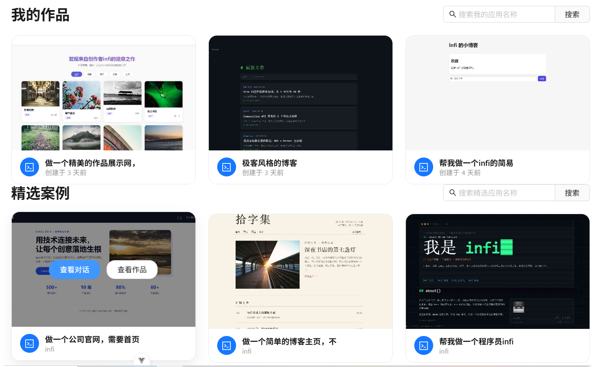
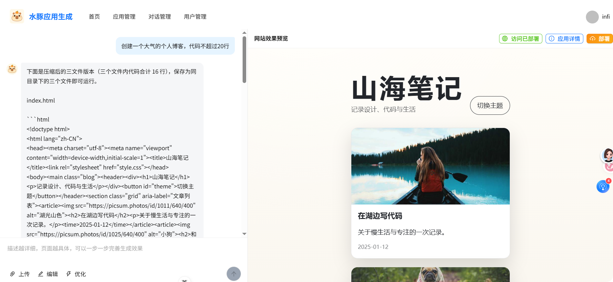
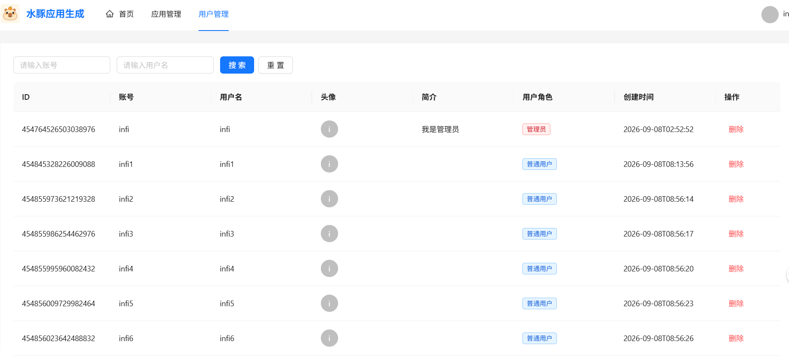
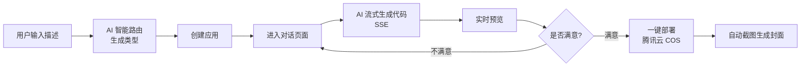

# AI Code Mother - AI 零代码应用生成平台

> 通过自然语言对话，一键生成可部署的 Web 应用。无需编写任何代码，描述你的想法，AI 帮你实现。


---

## 🚀 在线演示

> 点击下方链接即可在线体验，无需本地部署。

**在线体验地址：** [https://nocode.ziyuanzz.online](https://nocode.ziyuanzz.online)

演示环境说明：

- 支持注册/登录，登录后可完整体验「对话生成 → 实时预览 → 可视化编辑 → 一键部署 → 下载代码」全流程
- 演示环境已配置 AI 模型与对象存储，可直接生成并部署应用
- 为保障服务稳定，演示环境对 AI 对话接口做了限流，高峰期可能需要稍等

---

## 目录

- [功能特性](#功能特性)
- [界面预览](#界面预览)
- [技术栈](#技术栈)
- [快速开始](#快速开始)
- [生产部署](#生产部署)
- [项目结构](#项目结构)
- [核心流程](#核心流程)
- [API 文档](#api-文档)
- [设计模式](#设计模式)
- [常见问题](#常见问题-faq)
- [License](#license)

---

## 功能特性

- **对话式生成**：输入自然语言描述，AI 自动生成完整的网页应用
- **三种生成模式**：
  - **原生 HTML 模式**：生成单个 HTML 文件（内联 CSS/JS）
  - **原生多文件模式**：生成 HTML + CSS + JS 多文件结构
  - **Vue 工程模式**：AI 智能体通过文件读写工具直接在沙箱中构建完整的 Vue 3 工程
- **生成类型智能路由**：AI 根据用户需求自动推荐最合适的代码生成模式
- **实时预览**：生成代码后即时在浏览器中预览效果
- **可视化编辑**：在预览页面中直接选中元素进行编辑，所见即所得
- **多轮对话**：支持持续对话迭代优化生成的页面（Redis 聊天记忆 + 对话历史持久化）
- **一键部署**：生成满意的应用后可一键部署到腾讯云 COS，获得独立访问链接
- **代码下载**：可将生成的完整项目打包下载（含 Vue 工程）
- **封面自动截图**：部署后通过 Selenium 自动截取应用页面作为封面图
- **精选案例**：首页展示优质应用案例，激发创作灵感
- **用户管理**：支持注册登录，管理员可管理用户、应用和对话历史

## 界面预览

### 主页




### 对话生成网页



### 应用管理（管理员）


### 用户管理（管理员）


## 技术栈

### 后端

| 技术 | 版本 | 说明 |
|------|------|------|
| Java | 21 | 编程语言 |
| Spring Boot | 3.4.1 | 应用框架 |
| MyBatis-Flex | 1.11.0 | ORM 框架 |
| LangChain4j | 1.1.0 | AI 模型集成（OpenAI 兼容接口） |
| MySQL | 8.x | 数据库 |
| Redis | - | 会话存储（Spring Session）+ AI 聊天记忆 |
| Knife4j | 4.4.0 | API 文档 |
| 腾讯云 COS | 5.6.227 | 对象存储（应用部署、封面图） |
| Selenium | 4.33.0 | 网页截图（应用封面） |
| Caffeine | - | 本地缓存 |
| Hutool | 5.8.38 | 工具库 |

### 前端

| 技术 | 版本 | 说明 |
|------|------|------|
| Vue | 3.5 | 前端框架 |
| TypeScript | 6.0 | 编程语言 |
| Vite | 8.x | 构建工具 |
| Ant Design Vue | 4.x | UI 组件库 |
| Pinia | 4.x | 状态管理 |
| Vue Router | 5.x | 路由管理 |
| Axios | 1.x | HTTP 客户端 |
| @umijs/openapi | 1.x | 根据后端接口自动生成 TS 类型与请求代码 |

## 快速开始

### 环境要求

- JDK 21+
- Node.js >= 22.18.0
- MySQL 8.x
- Redis（本地默认 `localhost:6379`）
- Maven（或使用项目自带的 `mvnw`）

### 1. 克隆项目

```bash
git clone https://github.com/zhouyinfei/infi-ai-code-mother.git
cd infi-ai-code-mother
```

### 2. 初始化数据库

```bash
mysql -u root -p < sql/create_table.sql
```

这将创建 `infi_ai_code_mother` 数据库及 `user`（用户）、`app`（应用）、`chat_history`（对话历史）三张表。

### 3. 配置后端

编辑 `src/main/resources/application-local.yml`（该文件已被 `.gitignore` 忽略，密钥不会入库），配置 AI 模型与对象存储参数：

```yaml
# AI 模型（OpenAI 兼容接口，如阿里云百炼）
langchain4j:
  open-ai:
    chat-model:
      base-url: your-api-base-url
      api-key: your-api-key
      model-name: your-model-name
      timeout: PT120S
      max-retries: 2
      max-tokens: 8192
    streaming-chat-model:
      base-url: your-api-base-url
      api-key: your-api-key
      model-name: your-model-name
      max-tokens: 8192

# 腾讯云对象存储（应用部署与封面图存储）
cos:
  client:
    host: your-cos-domain
    secretId: your-secret-id
    secretKey: your-secret-key
    region: ap-beijing
    bucket: your-bucket-name
```

> 💡 首次使用可参考 `src/main/resources/application.yml` 中的完整配置结构（含推理模型、智能路由模型、Pexels 图片搜索、DashScope 等可选项）。

确保 `application.yml` 中的数据库连接信息正确（默认 `localhost:3306/infi_ai_code_mother`，账号 `root`）、Redis 连接正确（默认 `localhost:6379`）。

### 4. 启动后端

```bash
./mvnw spring-boot:run
```

后端服务运行在 `http://localhost:8123/api`，Knife4j API 文档访问地址：`http://localhost:8123/api/doc.html`

### 5. 启动前端

```bash
cd infi-ai-code-mother-frontend
npm install
npm run dev
```

前端开发服务器默认运行在 `http://localhost:5173`，已配置将 `/api` 请求代理到后端 `http://localhost:8123`。

生产构建：

```bash
npm run build
```

## 生产部署

### 后端打包

```bash
./mvnw clean package -DskipTests
```

生成可执行 JAR：`target/infi-ai-code-mother-*.jar`，直接运行：

```bash
java -jar target/infi-ai-code-mother-*.jar --spring.profiles.active=prod
```

> 生产环境建议新建 `application-prod.yml`（同样不入库），配置线上数据库、Redis、AI 模型与 COS 参数。

### 前端构建

```bash
cd infi-ai-code-mother-frontend
npm install
npm run build
```

产物输出到 `infi-ai-code-mother-frontend/dist/`。

### Nginx 反向代理（前后端同域部署示例）

```nginx
server {
    listen 80;
    server_name your-domain.com;

    # 前端静态资源
    root /var/www/infi-ai-code-mother/dist;
    index index.html;

    # 前端路由（history 模式）
    location / {
        try_files $uri $uri/ /index.html;
    }

    # 后端 API 反向代理
    location /api/ {
        proxy_pass http://127.0.0.1:8123;
        proxy_set_header Host $host;
        proxy_set_header X-Real-IP $remote_addr;
        proxy_set_header X-Forwarded-For $proxy_add_x_forwarded_for;

        # SSE 流式对话必需
        proxy_buffering off;
        proxy_cache off;
        proxy_read_timeout 300s;
        proxy_http_version 1.1;
        proxy_set_header Connection "";
    }
}
```

部署完成后，访问 `https://your-domain.com` 即可使用完整功能。建议同时配置 HTTPS（如 certbot 免费证书）。

## 项目结构

```
infi-ai-code-mother/
├── src/main/java/org/infi/infiaicodemother/
│   ├── ai/                  # AI 服务集成层（LangChain4j）
│   │   ├── model/           # AI 响应/流式消息模型
│   │   └── tool/            # AI 工具（文件读写/修改/删除/目录遍历）
│   ├── annotation/          # 自定义注解（@AuthCheck 权限校验）
│   ├── aop/                 # AOP 拦截器
│   ├── common/              # 通用响应、分页请求
│   ├── config/              # Spring 配置（CORS、JSON、COS、流式模型、Redis 聊天记忆）
│   ├── constant/            # 常量定义
│   ├── controller/          # REST 控制器
│   ├── core/                # 核心业务逻辑
│   │   ├── builder/         # Vue 工程构建器
│   │   ├── handler/         # 流式消息处理器
│   │   ├── parser/          # AI 输出代码解析器
│   │   └── saver/           # 代码文件保存器（模板方法模式）
│   ├── exception/           # 异常处理
│   ├── generator/           # MyBatis 代码生成器
│   ├── manager/             # 腾讯云 COS 管理
│   ├── mapper/              # MyBatis-Flex Mapper
│   ├── model/               # 数据模型（DTO / Entity / VO / Enum）
│   ├── service/             # 业务服务层
│   └── utils/               # 工具类（Selenium 网页截图等）
├── src/main/resources/
│   ├── application.yml      # 主配置文件
│   ├── application-local.yml# 本地开发配置（AI 模型、COS，不入库）
│   ├── mapper/              # MyBatis XML
│   └── prompt/              # AI 系统提示词模板（含生成类型路由）
├── infi-ai-code-mother-frontend/   # Vue 3 前端项目
│   └── src/
│       ├── api/             # 接口请求层（openapi 自动生成）
│       ├── pages/           # 页面（首页/对话生成/管理后台等）
│       └── composables/     # 组合式函数（可视化编辑等）
├── sql/                     # 数据库初始化脚本
├── doc/                     # 接口文档
├── img/                     # README 图片
└── tmp/                     # 运行时目录（代码输出/部署产物/截图，不入库）
```

## 核心流程



1. 用户在首页输入自然语言描述（如"做一个现代风格的电商首页"），AI 自动推荐生成模式（HTML / 多文件 / Vue 工程）
2. 进入对话页面，AI 通过 SSE 流式生成网页代码并实时推送
3. 右侧面板实时预览生成结果，可切换**可视化编辑**模式直接点选元素修改
4. 用户可通过继续对话修改和完善页面，对话历史持久化存储、随时回看
5. 满意后点击部署，应用上传至腾讯云 COS 并返回独立访问链接，同时自动截取页面作为封面
6. 支持将生成的应用代码（含 Vue 工程）打包下载

## API 文档

启动后端后访问 Knife4j 文档：`http://localhost:8123/api/doc.html`（springdoc 原生：`http://localhost:8123/api/swagger-ui.html`）

主要接口：

| 接口 | 方法 | 说明 |
|------|------|------|
| `/api/app/add` | POST | 创建应用 |
| `/api/app/chat/gen/code` | GET | SSE 流式对话生成代码 |
| `/api/app/deploy` | POST | 部署应用（COS） |
| `/api/app/download/{appId}` | GET | 下载应用代码 |
| `/api/app/update` | POST | 更新应用 |
| `/api/app/delete` | POST | 删除应用 |
| `/api/app/get/vo` | GET | 获取应用信息 |
| `/api/app/my/list/page/vo` | POST | 获取我的应用列表（分页） |
| `/api/app/good/list/page/vo` | POST | 获取精选应用列表（分页） |
| `/api/app/admin/list/page/vo` | POST | 管理端应用列表 |
| `/api/chatHistory/app/{appId}` | GET | 获取应用对话历史 |
| `/api/user/register` | POST | 用户注册 |
| `/api/user/login` | POST | 用户登录 |
| `/api/user/get/login` | GET | 获取当前登录用户 |
| `/api/user/logout` | POST | 退出登录 |
| `/api/user/list/page/vo` | POST | 用户列表（管理端） |
| `/api/static/{deployKey}/**` | GET | 访问已部署应用的静态资源 |
| `/api/health/` | GET | 健康检查 |

> 注：管理端接口（`admin`）与对话生成、部署等接口需要登录鉴权。

## 设计模式

项目运用了多种经典设计模式：

- **策略模式**：通过 `CodeGenTypeEnum` 枚举驱动不同的代码生成路径（HTML / 多文件 / Vue 工程）
- **模板方法模式**：`CodeFileSaverTemplate` 抽象基类定义保存流程，子类实现具体保存逻辑
- **门面模式**：`AiCodeGeneratorFacade` 统一编排 AI 生成、代码解析、文件保存
- **工厂模式**：`AiCodeGeneratorServiceFactory` 管理 AI 服务实例的创建，`CodeParserExecutor` / `CodeFileSaverExecutor` 按类型路由解析与保存实现

## 常见问题 (FAQ)

**Q: 对话时 AI 不回复或报错？**
检查 `application-local.yml` 中 AI 模型的 `base-url` / `api-key` / `model-name` 是否正确，并确认网络可访问该接口；流式接口建议 `timeout` 配置为 `PT120S` 以上。

**Q: 部署后页面能打开但接口 404？**
确认 Nginx 中 `/api/` 的 `proxy_pass` 是否指向了后端端口（默认 `8123`），且后端已启动。SSE 对话异常时检查是否配置了 `proxy_buffering off`。

**Q: 一键部署应用后访问链接打不开？**
检查 COS 的 `bucket` 是否已开启公有读（或配置 CDN），并确认 `host` 域名与 bucket 对应区域一致。

**Q: 忘记管理员账号？**
注册用户后，直接在数据库 `user` 表中将目标用户 `user_role` 修改为 `admin`（1）即可。

## License

MIT License
